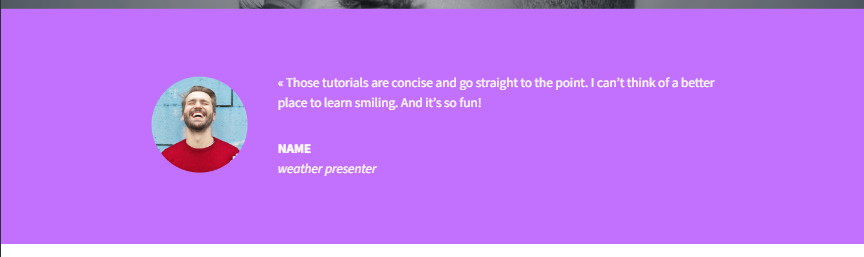
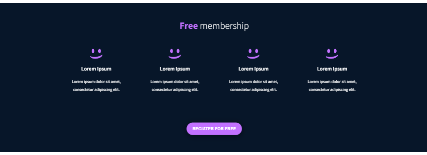
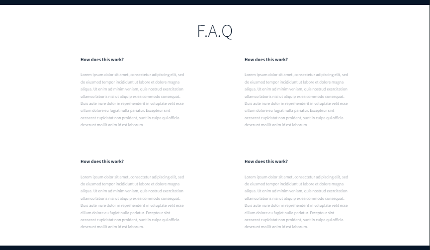
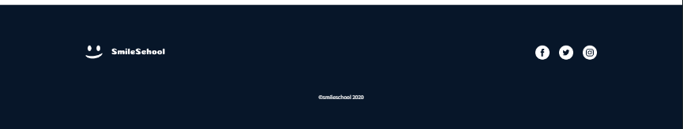

# alx_html_css

## Overview
This project is a showcase of a beautifully designed website, crafted with care and attention to detail. The website features a range of sections, including a hero section, features, quote, videos, membership, FAQ, and footer. Each section is carefully designed to provide a seamless user experience, with a focus on typography, color, and layout.

## Features
### Responsive design:
The website is fully responsive, ensuring a great user experience on desktop, tablet, and mobile devices.
### Custom typography:
The website features a custom typography system, with carefully selected font families and font sizes to create a harmonious reading experience.
### Color scheme:
The website features a bold and vibrant color scheme, with a focus on accessibility and readability.
### Sectional layout:
The website is divided into clear sections, each with its own unique design and layout.
Interactive elements: The website features interactive elements, such as buttons and hover effects, to enhance the user experience.

## Acknowledgments
This project was built using a range of tools and resources, including:

Source Sans 3 font family
CSS Grid for layout
Flexbox for layout
We hope you enjoy using this project!

/To get started with this project, simply clone the repository and open the index.html file in your favorite web browser./

## Visuals 

