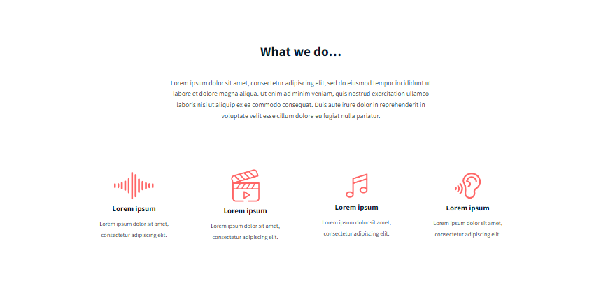
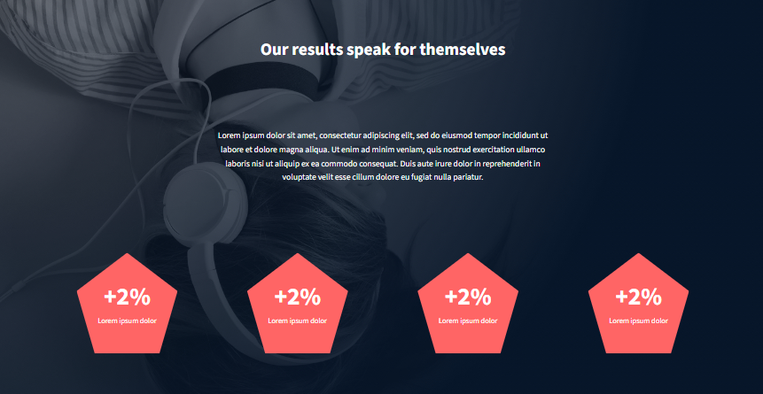

# Headphones Website
Welcome to the Headphones Website, a sleek and modern web application designed to showcase the power of audio technology.

## Overview
This website is built using HTML, CSS, and a touch of magic. It features a responsive design, making it perfect for viewing on desktop, tablet, or mobile devices. The website is divided into five main sections: Header, Action, What We Do, Our Results, and Contact Us.

## Visuals
Here's a sneak peek of what you can expect:

## Header
Header Section

## Action
Action Section

## What We Do
What We Do Section

## Our Results
Our Results Section

## Contact Us
Contact Us Section

## Footer
Footer Section

## Features
Responsive design for optimal viewing on various devices
Modern typography using the Source Sans 3 font family
Custom-designed icons and graphics
Interactive hamburger menu for easy navigation
Call-to-action buttons to encourage user engagement
Pentagon-shaped graphics to display key statistics
Getting Started
To get started, simply open the index.html file in your favorite web browser. You can also customize the website by modifying the CSS styles in the 7-styles.css file.

## Contributing
If you'd like to contribute to this project, please fork the repository and submit a pull request. We welcome any suggestions or improvements you may have!

## Acknowledgments
Special thanks to the designers and developers who inspired this project. Your work is truly appreciated!

Happy coding!